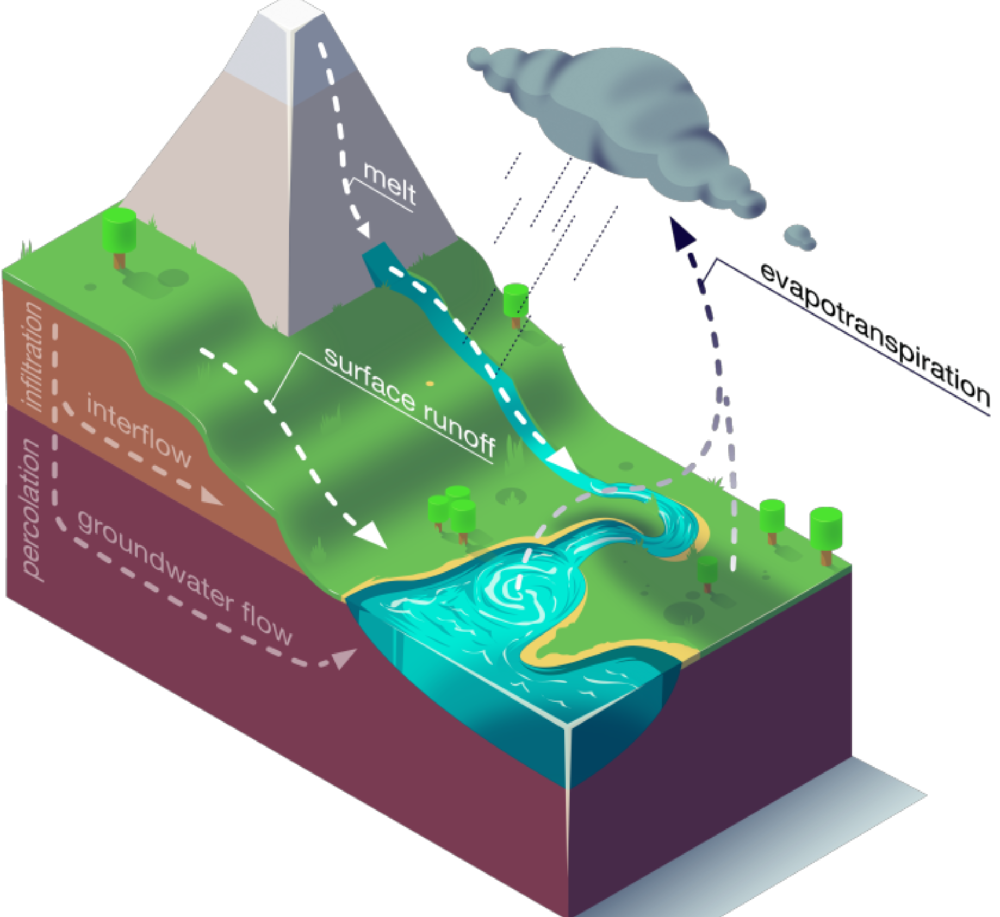

---
format:
  revealjs:
    width: 1280
    height: 720
    title-slide: false
    slide-number: true
    theme: default
    css: slides.css
    self-contained: true
    include-in-header:
      - nav-include.html
bibliography: book.bib
execute:
  echo: false
  warning: false
  message: false
editor: source
---

```{r setup, include=FALSE}
knitr::opts_chunk$set(echo = FALSE, fig.align = "center",
                      warning = FALSE, message = FALSE)
library(ggplot2)
library(knitr)

if (!requireNamespace("maps", quietly = TRUE)) {
  install.packages("maps", repos = "https://cloud.r-project.org")
}

theme_nh <- function(base_size = 13) {
  theme_minimal(base_size = base_size) +
    theme(
      plot.title    = element_text(face = "bold", size = base_size + 1),
      plot.subtitle = element_text(colour = "grey40", size = base_size - 1),
      legend.position = "bottom",
      panel.grid.minor = element_blank()
    )
}

lmu_blue  <- "#00558C"
lmu_light <- "#6AB0DE"
grey50    <- "#888888"
green_ok  <- "#388E3C"
amber     <- "#F57F17"

# Load all EA-LSTM result tables once in setup so later slides can use shared objects.
rq3_group <- read.csv(
  "../rq3_finetune/results_folder_groups_summary_with_global_true_ea.csv",
  stringsAsFactors = FALSE
)
rq3_all <- read.csv(
  "../rq3_finetune/results_folder_groups_all_basins_ea.csv",
  stringsAsFactors = FALSE
)
g01_local_ft <- read.csv(
  "../rq3_finetune/results_folder_05_local_vs_finetune_ea.csv",
  stringsAsFactors = FALSE
)
g01_global <- read.csv(
  "../rq3_finetune/results_folder_05_global_eval_true_ea.csv",
  stringsAsFactors = FALSE
)

rq3_group$group <- sprintf("%02d", as.integer(rq3_group$group))
rq3_all$group <- sprintf("%02d", as.integer(rq3_all$group))
g01_local_ft$basin <- sprintf("%08d", as.integer(g01_local_ft$basin))
g01_global$basin <- sprintf("%08d", as.integer(g01_global$basin))
g01_merged <- merge(g01_local_ft, g01_global[, c("basin", "NSE", "KGE")], by = "basin", all.x = TRUE)

# Also load CudaLSTM results for comparison
rq3_group_cuda <- read.csv(
  "../rq3_finetune/results_folder_groups_summary_with_global_true.csv",
  stringsAsFactors = FALSE
)
rq3_all_cuda <- read.csv(
  "../rq3_finetune/results_folder_groups_all_basins.csv",
  stringsAsFactors = FALSE
)
g01_local_ft_cuda <- read.csv(
  "../rq3_finetune/results_folder_01_local_vs_finetune.csv",
  stringsAsFactors = FALSE
)
g01_global_cuda <- read.csv(
  "../rq3_finetune/results_folder_01_global_eval_true.csv",
  stringsAsFactors = FALSE
)
rq3_group_cuda$group <- sprintf("%02d", as.integer(rq3_group_cuda$group))
rq3_all_cuda$group <- sprintf("%02d", as.integer(rq3_all_cuda$group))
g01_local_ft_cuda$basin <- sprintf("%08d", as.integer(g01_local_ft_cuda$basin))
g01_global_cuda$basin <- sprintf("%08d", as.integer(g01_global_cuda$basin))
g01_merged_cuda <- merge(g01_local_ft_cuda, g01_global_cuda[, c("basin", "NSE", "KGE")], by = "basin", all.x = TRUE)

# EA-LSTM overall metrics
overall_local <- weighted.mean(rq3_group$local_nse_mean, rq3_group$n_basins)
overall_global <- weighted.mean(rq3_group$global_nse_mean, rq3_group$n_basins)
overall_ft <- weighted.mean(rq3_group$ft_nse_mean, rq3_group$n_basins)

overall_local_kge <- weighted.mean(rq3_group$local_kge_mean, rq3_group$n_basins)
overall_ft_kge <- weighted.mean(rq3_group$ft_kge_mean, rq3_group$n_basins)
overall_global_kge <- weighted.mean(rq3_group$global_kge_mean, rq3_group$n_basins)

# CudaLSTM overall metrics
overall_local_cuda <- weighted.mean(rq3_group_cuda$local_nse_mean, rq3_group_cuda$n_basins)
overall_global_cuda <- weighted.mean(rq3_group_cuda$global_nse_mean, rq3_group_cuda$n_basins)
overall_ft_cuda <- weighted.mean(rq3_group_cuda$ft_nse_mean, rq3_group_cuda$n_basins)

overall_local_kge_cuda <- weighted.mean(rq3_group_cuda$local_kge_mean, rq3_group_cuda$n_basins)
overall_ft_kge_cuda <- weighted.mean(rq3_group_cuda$ft_kge_mean, rq3_group_cuda$n_basins)
overall_global_kge_cuda <- weighted.mean(rq3_group_cuda$global_kge_mean, rq3_group_cuda$n_basins)

ft_beats_local_groups <- sum(rq3_group$delta_ft_vs_local_nse > 0)
ft_beats_global_groups <- sum(rq3_group$delta_ft_vs_global_nse > 0)
ft_beats_local_groups_cuda <- sum(rq3_group_cuda$delta_ft_vs_local_nse > 0)
ft_beats_global_groups_cuda <- sum(rq3_group_cuda$delta_ft_vs_global_nse > 0)

orig_g01 <- rq3_group[rq3_group$group == "05", ]
logo01_local <- orig_g01$local_nse_mean[1]
logo01_global <- orig_g01$global_nse_mean[1]
logo01_ft <- orig_g01$ft_nse_mean[1]
logo01_ft_vs_local <- orig_g01$delta_ft_vs_local_nse[1]
logo01_ft_vs_global <- orig_g01$delta_ft_vs_global_nse[1]
logo01_global_vs_local <- orig_g01$delta_global_vs_local_nse[1]
logo01_ft_beats_local <- sum(g01_merged$ft_nse > g01_merged$local_nse, na.rm = TRUE)
logo01_ft_beats_global <- sum(g01_merged$ft_nse > g01_merged$NSE, na.rm = TRUE)
logo01_global_beats_local <- sum(g01_merged$NSE > g01_merged$local_nse, na.rm = TRUE)

orig_g01_cuda <- rq3_group_cuda[rq3_group_cuda$group == "01", ]
logo01_local_cuda <- orig_g01_cuda$local_nse_mean[1]
logo01_global_cuda <- orig_g01_cuda$global_nse_mean[1]
logo01_ft_cuda <- orig_g01_cuda$ft_nse_mean[1]
logo01_ft_vs_local_cuda <- orig_g01_cuda$delta_ft_vs_local_nse[1]
logo01_ft_vs_global_cuda <- orig_g01_cuda$delta_ft_vs_global_nse[1]
logo01_global_vs_local_cuda <- orig_g01_cuda$delta_global_vs_local_nse[1]
logo01_ft_beats_local_cuda <- sum(g01_merged_cuda$ft_nse > g01_merged_cuda$local_nse, na.rm = TRUE)
logo01_ft_beats_global_cuda <- sum(g01_merged_cuda$ft_nse > g01_merged_cuda$NSE, na.rm = TRUE)
logo01_global_beats_local_cuda <- sum(g01_merged_cuda$NSE > g01_merged_cuda$local_nse, na.rm = TRUE)
```

##  {.cover-slide data-section="Cover"}

::::::::::::::: columns
:::::::::::: {.column width="45%"}
::::::::::: cover-left
::: cover-title
**Neural Hydrology**
:::

::: cover-subtitle
Deep Learning for Streamflow Prediction under Climate Change
:::

:::::::: cover-meta
<div><strong>Author:</strong> Yuxin Qiu</div>
<div><strong>Supervisor:</strong> Henri Funk</div>
<div><strong>Seminar:</strong> Climate Change Statistics</div>
<div><strong>University:</strong> LMU Munich</div>
<div><strong>Date:</strong> 2026-07-15 &ensp;·&ensp; Final Presentation</div>
::::::::
:::::::::::
::::::::::::

:::: {.column width="30%"}
::: cover-right
{.cover-img style="object-position: 100% center; transform: translateX(8%);"}
:::
::::
:::::::::::::::


## Contents {data-section="Introduction"}

- **Fundamentals:** Streamflow prediction, why it matters, progress in deep learning
- **Research gap:** Regional Performance & Transfer Learning
- **Methodology:** LSTM, metrics, CAMELS dataset, three-way experimental design
- **Empirical results:** Group-level and basin-level findings, validation, patterns
- **Discussion:** Recommendations for practitioners, limitations, future work


## What is Neural Hydrology? {data-section="Introduction"}

::::::::::::::: columns
:::::::::::: {.column width="58%"}

**Streamflow** is the volume of water flowing through a river channel at a given point per unit time — typically measured in mm/day or m³/s. It is the integrated output of the entire catchment: precipitation, evaporation, soil infiltration, and groundwater dynamics all feed into it [@addor2017].

**Rainfall-runoff modelling** is the task of predicting daily streamflow $Q$ from meteorological inputs (precipitation, temperature, radiation) — a long-standing central problem in hydrology [@kratzert2018].

**Neural Hydrology** is the application of deep learning to this problem. Instead of hand-crafting physical equations, a neural network learns the input-to-streamflow mapping directly from data, across hundreds of catchments simultaneously.

::::::::::::

:::::::::::: {.column width="42%"}
<div style="text-align:center; margin-top: 18px;">
  
</div>
::::::::::::
:::::::::::::::

## Why Streamflow Prediction Matters {data-section="Introduction"}

::: {style="font-size: 1.05em;"}
-   **Floods** are the most frequent natural disaster — 57 million people affected in 2022 alone [@cred2022]
-   Accurate **streamflow forecasts** are critical for flood early-warning, reservoir management, and hydropower scheduling
-   Under **climate change**, precipitation extremes intensify, seasonal patterns shift, and snowmelt regimes change [@ipcc2021]
-   Hydrological models must be **robust to non-stationarity** — conditions outside the historical training distribution
:::

. . .

> Milly et al. (2008) framed the challenge as *"Stationarity is dead: Whither water management?"* [@milly2008]


## Milestones in Neural Hydrology {data-section="Background"}

```{r nh-milestones-timeline, fig.height=3.8, fig.width=11.0}
milestones <- data.frame(
  year = c(2018, 2019, 2021, 2022, 2023),
  label = c(
    "LSTM rainfall-runoff\nbeats SAC-SMA",
    "EA-LSTM\n531 CAMELS basins",
    "MC-LSTM\nmass conservation",
    "NeuralHydrology\nunified framework",
    "Caravan\n6,830 catchments"
  ),
  y = c(0.22, -0.22, 0.22, -0.22, 0.22)
)

ggplot(milestones, aes(x = year, y = 0)) +
  geom_segment(aes(x = min(year) - 0.2, xend = max(year) + 0.2, y = 0, yend = 0),
               color = grey50, linewidth = 1) +
  geom_segment(aes(x = year, xend = year, y = 0, yend = y),
               color = grey50, linewidth = 0.9) +
  geom_point(size = 5, color = lmu_blue) +
  geom_label(aes(y = y, label = label),
             size = 3.9, fill = "white", label.size = 0.2, label.padding = unit(0.18, "lines")) +
  geom_text(aes(y = -0.34, label = year), size = 4.2, fontface = "bold", color = "black") +
  scale_x_continuous(breaks = milestones$year, limits = c(2017.5, 2023.5)) +
  coord_cartesian(ylim = c(-0.42, 0.42), clip = "off") +
  labs(x = NULL, y = NULL) +
  theme_void() +
  theme(plot.margin = margin(10, 30, 10, 30))
```


## LSTM and EA-LSTM {data-section="Background"}

The LSTM [@hochreiter1997] maintains a **cell state** $\mathbf{c}_t$ as hydrological memory:

$$\mathbf{c}_t = \underbrace{\mathbf{f}_t \odot \mathbf{c}_{t-1}}_{\text{long-term memory}} + \underbrace{\mathbf{i}_t \odot \tanh(\mathbf{W}_g [\mathbf{h}_{t-1}, \mathbf{x}_t] + \mathbf{b}_g)}_{\text{new information}} \qquad \mathbf{h}_t = \mathbf{o}_t \odot \tanh(\mathbf{c}_t)$$

Cell state $\approx$ soil moisture / groundwater · Forget gate $\approx$ drainage · Input gate $\approx$ infiltration

. . .

**Entity-Aware LSTM** [@kratzert2019] — conditions the input gate on static catchment attributes $\mathbf{x}_s$:

$$\mathbf{i} = \sigma(\mathbf{W}_i \mathbf{x}_s + \mathbf{b}_i)$$


## Evaluation Metric I: NSE {data-section="Background"}

**NSE** (Nash-Sutcliffe Efficiency):
$$
\mathrm{NSE} = 1 - \frac{\sum_{t=1}^{T}(\hat{q}_t - q_t)^2}{\sum_{t=1}^{T}(q_t - \bar{q})^2}
$$

Where:
- $\hat{q}_t$: predicted streamflow at time $t$
- $q_t$: observed streamflow at time $t$
- $\bar{q}$: mean of observed streamflow over evaluation period
- $T$: number of timesteps

Interpretation:
- Range: $(-\infty, 1]$, with 1 as perfect prediction
- 0 means model performs like using the observed mean as predictor
- $<0$ means model is worse than the mean benchmark


## Evaluation Metric II: KGE {data-section="Background"}

**KGE** (Kling-Gupta Efficiency):
$$
\mathrm{KGE} = 1 - \sqrt{(r-1)^2 + (\alpha-1)^2 + (\beta-1)^2}
$$
with
$$
r = \mathrm{corr}(\hat{q}, q), \quad
\alpha = \frac{\sigma_{\hat{q}}}{\sigma_q}, \quad
\beta = \frac{\mu_{\hat{q}}}{\mu_q}
$$

Where:
- $r$: correlation term (timing/dynamics agreement)
- $\alpha$: variability ratio (spread of predictions vs observations)
- $\beta$: bias ratio (mean prediction vs mean observation)

Interpretation:
- Best value is 1
- KGE balances timing, variability, and bias in one metric
- Useful complement to NSE for diagnosing model behavior


## NeuralHydrology: Python Library {data-section="Background"}

**NeuralHydrology** [@kratzert2022joss] — open-source PyTorch library built for reproducible deep learning in hydrology:

::: {style="font-size: 1.0em;"}
-   **Config-file driven** — a single `.yml` file specifies the full experiment; no source code changes between runs
-   **Model zoo** — 15+ architectures: CudaLSTM, EA-LSTM, MC-LSTM, MTS-LSTM, Transformer, Mamba, xLSTM, HybridModel
-   **Dataset zoo** — CAMELS-US/GB/DE/AUS/CL, Caravan (>6 000 basins globally)
-   **Probabilistic heads** — GMM, CMAL, UMAL for uncertainty quantification
-   **Evaluation** — NSE, KGE, MSE, hydrological signatures built-in
:::

``` bash
uv pip install neuralhydrology
nh-run train    --config-file config.yml
nh-run evaluate --run-dir    runs/my_run/
```

## The Research Gap: Why Transfer Learning? {data-section="Research gap"}

**Progress in global streamflow modeling:**
- 2018–2021: LSTM and EA-LSTM trained *globally* on 500+ basins → excellent median performance (NSE 0.72)
- 2022: NeuralHydrology library standardizes reproducible experiments

**The unresolved question:**
- Global models generalize well *on average*, but **regional performance is heterogeneous**
- Some regions (data-sparse, extreme climates) lag behind others

**An untested idea:**
- What if we try **transfer learning** for hydrology?
- Start from global pretraining, then adapt locally?
- Would this beat local-from-scratch in data-scarce regions?
- How stable are gains across different geographic groups?


## CAMELS-US Dataset Overview {data-section="Methodology"}

**CAMELS** (Catchment Attributes and MEteorology for Large-sample Studies) — a large-sample hydrology dataset from the US Geological Survey [@addor2017]:

::: {style="font-size: 1.0em;"}
- **531 watershed locations** across the contiguous United States
- **Geographic diversity:** heterogeneous climates, geology, terrain, land cover
- **Time series:** Daily streamflow records (1980–2014)
- **Meteorological inputs:** Daymet dataset
  - Precipitation (mm/day), minimum/maximum temperature (°C)
  - Solar radiation (W/m²), vapor pressure (Pa)
- **Static attributes:** Catchment area, slope, elevation, vegetation index, soil properties
:::

Enables **large-scale transfer-learning research** without the confound of data-source heterogeneity.


## CAMELS-US Basins by Group (Map) {data-section="Methodology"}

```{r camels-us-group-map, fig.height=4.8, fig.width=10.8}
topo <- read.csv(
  "../data/CAMELS_US/camels_attributes_v2.0/camels_topo.txt",
  sep = ";",
  stringsAsFactors = FALSE
)

basin_group <- unique(rq3_all[, c("basin", "group")])
basin_group$basin <- sprintf("%08d", as.integer(basin_group$basin))
topo$gauge_id <- sprintf("%08d", as.integer(topo$gauge_id))

map_df <- merge(
  topo[, c("gauge_id", "gauge_lat", "gauge_lon")],
  basin_group,
  by.x = "gauge_id",
  by.y = "basin"
)
map_df$group <- factor(sprintf("%02d", as.integer(map_df$group)))

has_maps <- requireNamespace("maps", quietly = TRUE)

if (has_maps) {
  usa <- ggplot2::map_data("state")
}

p <- ggplot()

if (has_maps) {
  p <- p +
    geom_polygon(
      data = usa,
      aes(x = long, y = lat, group = group),
      fill = "grey96",
      color = "grey80",
      linewidth = 0.25,
      inherit.aes = FALSE
    )
}

p <- p +
  geom_point(
    data = map_df,
    aes(x = gauge_lon, y = gauge_lat, color = group),
    size = 1.7,
    alpha = 0.9
  ) +
  scale_color_viridis_d(name = "Group", option = "turbo", end = 0.95) +
  coord_quickmap(xlim = c(-125, -66), ylim = c(24, 50), expand = FALSE) +
  labs(
    x = NULL,
    y = NULL,
    subtitle = "CAMELS-US basins colored by 18 geographic groups"
  ) +
  theme_nh() +
  theme(
    panel.grid = element_blank(),
    axis.text = element_blank(),
    axis.ticks = element_blank(),
    legend.position = "bottom",
    legend.key.width = grid::unit(0.45, "cm")
  ) +
  guides(color = guide_legend(nrow = 2, byrow = TRUE, override.aes = list(size = 3)))

p
```


## Temporal Splits and Distribution Shift {data-section="Methodology"}

| Split | Period | Length | Role |
|---|---|---:|---|
| Training | 1999-2008 | 10 years | Parameter learning |
| Validation | 1989-1998 | 10 years | Hyperparameter/model selection |
| Testing | 2008-2014 | 6 years | Final out-of-sample evaluation |

**Key point:** harder than standard contiguous splits, better for robustness testing.


## Input Features and Variables {data-section="Methodology"}

::: {style="font-size: 0.82em;"}

**Meteorological inputs (daily):**

| Symbol(s) | Description | Unit |
|---|---|---|
| $P_t$ | Precipitation | mm/day |
| $T_{\min,t}, T_{\max,t}$ | Min/max temperature | °C |
| $R_t$ | Solar radiation | W/m² |
| $V_t$ | Vapor pressure | Pa |

**Static catchment attributes:**

| Symbol(s) | Description | Unit |
|---|---|---|
| $A, S, E$ | Area, slope, elevation | km², %, m |
| $F_{\text{forest}}$ | Forest cover & soil | ratio, % |
| Climate index | Aridity, seasonality | index |

::::


## Output / Processing {data-section="Methodology"}

| Setting | Value |
|---|---|
| Target variable | Daily mean streamflow $Q_t$ (area-normalized) |
| Normalization | Zero-mean, unit-variance standardization |
| Sequence length | 365 timesteps (1-year lookback) |

## Data Quality and Availability {data-section="Methodology"}

**Coverage:** 531 basins across 18 geographic groups  
(Largest ~60 basins, smallest ~15, median ~28)

**Quality control:**
- Streamflow missingness: <1% (after USGS QC)
- Short gaps (≤3 days): linear interpolation
- Problematic basins: excluded (ice, weak signal)

**Why it matters:**  
*Data-sparse groups have higher training variance — exactly where transfer learning should help most.*


## Testable Predictions {data-section="Methodology"}

**H1: FT > Local?**  
Does transfer learning offset smaller local datasets?

**H2: FT > Global?**  
Does local fine-tuning beat zero-shot transfer?

**Metrics:**  
NSE (primary) + KGE (secondary), aggregated as weighted mean by group size

. . .

::: {style="font-size: 0.72em; line-height: 1.4;"}
**Experimental design:**  Three parallel arms isolate transfer benefit—*Local* (random init) answers data-only learning; *Global* (no fine-tune) answers zero-shot transfer; *Fine-tune* answers adaptation value. Without all three, we cannot separate transfer gain from model capacity.
:::

## Model and Training Setup {data-section="Methodology"}

::: {style="font-size: 1.02em;"}
- **Architecture:** EA-LSTM (NeuralHydrology standard)
- **Global scope:** 531 CAMELS-US basins pre-trained
- **Evaluation:** 18 geographic groups (Daymet-based), 531 basins total
- **Metrics:** NSE(primary), KGE(secondary)
:::

**Time-based splits:** Train 1999–2008, Val 1980–1989, Test 1989–1999 (intentional distribution shift)


## Evaluation Coverage: 18 Groups, 531 Basins {data-section="Methodology"}

```{r rq3-coverage-bars, fig.height=3.8, fig.width=9.8}
cov_df <- rq3_group[order(rq3_group$n_basins, decreasing = TRUE), c("group", "n_basins")]

ggplot(cov_df, aes(x = group, y = n_basins)) +
  geom_col(fill = lmu_blue, width = 0.68) +
  geom_text(aes(label = n_basins), vjust = -0.2, size = 3.2) +
  labs(
    x = "Geographic Group",
    y = "Number of basins",
    subtitle = "531 basins total across 18 Daymet-based groups"
  ) +
  theme_nh() +
  theme(axis.text.x = element_text(size = 9))
```


## Group Size Distribution {data-section="Methodology"}

```{r rq3-group-size-dist, fig.height=2.6, fig.width=6.4, out.width='88%'}
ggplot(rq3_group, aes(x = n_basins)) +
  geom_histogram(binwidth = 15, fill = lmu_light, color = "white", boundary = 0) +
  geom_vline(xintercept = median(rq3_group$n_basins), linetype = "dashed", color = grey50, linewidth = 0.8) +
  labs(
    x = "Basins per group",
    y = "Frequency"
  ) +
  theme_nh() +
  theme(axis.title = element_text(size = 11))
```


## Overall Weighted NSE Comparison {data-section="Results"}

```{r rq3-overall-nse, fig.height=3.3, fig.width=8.2, out.width='90%'}
overall_nse <- data.frame(
  model = factor(c("Local", "Global", "Fine-tune"), levels = c("Local", "Global", "Fine-tune")),
  nse = c(overall_local, overall_global, overall_ft)
)

ggplot(overall_nse, aes(x = model, y = nse, fill = model)) +
  geom_col(width = 0.58) +
  geom_text(aes(label = sprintf("%.3f", nse)), vjust = -0.25, fontface = "bold", size = 4) +
  scale_fill_manual(values = c("Local" = amber, "Global" = lmu_light, "Fine-tune" = lmu_blue)) +
  scale_y_continuous(expand = expansion(mult = c(0, 0.10))) +
  labs(x = NULL, y = "Weighted mean NSE") +
  theme_nh() +
  theme(legend.position = "none")
```


## Overall Weighted KGE Comparison {data-section="Results"}

```{r rq3-overall-kge, fig.height=3.3, fig.width=8.2, out.width='90%'}
overall_kge <- data.frame(
  model = factor(c("Local", "Global", "Fine-tune"), levels = c("Local", "Global", "Fine-tune")),
  kge = c(overall_local_kge, overall_global_kge, overall_ft_kge)
)

ggplot(overall_kge, aes(x = model, y = kge, fill = model)) +
  geom_col(width = 0.58) +
  geom_text(aes(label = sprintf("%.3f", kge)), vjust = -0.25, fontface = "bold", size = 4) +
  scale_fill_manual(values = c("Local" = amber, "Global" = lmu_light, "Fine-tune" = lmu_blue)) +
  scale_y_continuous(expand = expansion(mult = c(0, 0.10))) +
  labs(x = NULL, y = "Weighted mean KGE") +
  theme_nh() +
  theme(legend.position = "none")
```


## Group-Level NSE: Three-Way Comparison {data-section="Results"}

```{r rq3-three-way-by-group, fig.height=4.8, fig.width=10}
rq3_long <- rbind(
  data.frame(group = rq3_group$group, model = "Local", nse = rq3_group$local_nse_mean),
  data.frame(group = rq3_group$group, model = "Global", nse = rq3_group$global_nse_mean),
  data.frame(group = rq3_group$group, model = "Fine-tune", nse = rq3_group$ft_nse_mean)
)
rq3_long$model <- factor(rq3_long$model, levels = c("Local", "Global", "Fine-tune"))
group_levels <- sprintf("%02d", sort(as.integer(unique(rq3_group$group))))
rq3_long$group <- factor(rq3_long$group, levels = group_levels)

ggplot(rq3_long, aes(x = group, y = nse, fill = model)) +
  geom_col(position = position_dodge(width = 0.75), width = 0.64) +
  scale_fill_manual(values = c("Local" = amber, "Global" = lmu_light, "Fine-tune" = lmu_blue)) +
  scale_y_continuous(limits = c(-0.12, 0.92), expand = c(0, 0.01)) +
  labs(
    x = "Group (numeric order)",
    y = "Mean NSE"
  ) +
  theme_nh() +
  theme(axis.text.x = element_text(size = 9))
```


## Group-Level Delta NSE (FT vs Local and FT vs Global) {data-section="Results"}
```{r rq3-group-delta-nse, fig.height=4.3, fig.width=9.8}
gain_df <- data.frame(
  group = rq3_group$group,
  delta_ft_local = rq3_group$delta_ft_vs_local_nse,
  delta_ft_global = rq3_group$delta_ft_vs_global_nse
)

gain_long <- rbind(
  data.frame(group = gain_df$group, delta_type = "FT - Local", delta_nse = gain_df$delta_ft_local),
  data.frame(group = gain_df$group, delta_type = "FT - Global", delta_nse = gain_df$delta_ft_global)
)
gain_long$delta_type <- factor(gain_long$delta_type, levels = c("FT - Local", "FT - Global"))

ggplot(gain_long, aes(x = group, y = delta_nse, fill = delta_type)) +
  geom_col(position = position_dodge(width = 0.72), width = 0.62) +
  geom_hline(yintercept = 0, linetype = "dashed", color = grey50) +
  scale_fill_manual(values = c("FT - Local" = lmu_blue, "FT - Global" = green_ok)) +
  labs(
    x = "Group",
    y = "Delta NSE",
    fill = NULL
  ) +
  theme_nh() +
  theme(axis.text.x = element_text(size = 9))
```


## Group-Level Delta KGE (FT vs Local and FT vs Global) {data-section="Results"}

```{r rq3-group-delta-kge, fig.height=4.1, fig.width=9.6}
dk <- data.frame(
  group = rq3_group$group,
  delta_ft_local = rq3_group$ft_kge_mean - rq3_group$local_kge_mean,
  delta_ft_global = rq3_group$ft_kge_mean - rq3_group$global_kge_mean
)

dk_long <- rbind(
  data.frame(group = dk$group, delta_type = "FT - Local", delta_kge = dk$delta_ft_local),
  data.frame(group = dk$group, delta_type = "FT - Global", delta_kge = dk$delta_ft_global)
)
dk_long$delta_type <- factor(dk_long$delta_type, levels = c("FT - Local", "FT - Global"))

ggplot(dk_long, aes(x = group, y = delta_kge, fill = delta_type)) +
  geom_col(position = position_dodge(width = 0.72), width = 0.62) +
  geom_hline(yintercept = 0, linetype = "dashed", color = grey50) +
  scale_fill_manual(values = c("FT - Local" = lmu_blue, "FT - Global" = green_ok)) +
  labs(
    x = "Group",
    y = "Delta KGE",
    fill = NULL
  ) +
  theme_nh() +
  theme(axis.text.x = element_text(size = 9))
```

## Local Baseline vs Fine-Tuned Performance (Group Means) {data-section="Results"}

```{r rq3-scatter-local-ft, fig.height=3.6, fig.width=8.9}
ggplot(rq3_group, aes(x = local_nse_mean, y = ft_nse_mean, size = n_basins)) +
  geom_point(color = lmu_blue, alpha = 0.75) +
  geom_abline(slope = 1, intercept = 0, linetype = "dashed", color = grey50) +
  labs(
    x = "Local mean NSE",
    y = "Fine-tune mean NSE"
  ) +
  theme_nh()
```


## Basin-Level NSE Distribution {data-section="Results"}

```{r rq3-basin-boxplot, fig.height=4.2, fig.width=9.8}
basin_df <- data.frame(
  model = factor(c(rep("Local", nrow(rq3_all)), rep("Fine-tune", nrow(rq3_all))), levels = c("Local", "Fine-tune")),
  nse = c(rq3_all$local_nse, rq3_all$ft_nse)
)

ggplot(basin_df, aes(x = model, y = nse, fill = model)) +
  geom_boxplot(width = 0.55, alpha = 0.9, outlier.alpha = 0.25) +
  geom_jitter(width = 0.15, size = 0.7, alpha = 0.15, color = grey50) +
  scale_fill_manual(values = c("Local" = amber, "Fine-tune" = lmu_blue)) +
  labs(x = NULL, y = "Basin-level NSE", title = "Distribution shifts upward after fine-tuning") +
  theme_nh() +
  theme(legend.position = "none")
```


## Basin-Level ECDF of NSE {data-section="Results"}

```{r rq3-basin-ecdf, fig.height=4.0, fig.width=9.6}
ecdf_df <- data.frame(
  nse = c(rq3_all$local_nse, rq3_all$ft_nse),
  model = factor(c(rep("Local", nrow(rq3_all)), rep("Fine-tune", nrow(rq3_all))), levels = c("Local", "Fine-tune"))
)

ggplot(ecdf_df, aes(x = nse, color = model)) +
  stat_ecdf(linewidth = 1.2) +
  scale_color_manual(values = c("Local" = amber, "Fine-tune" = lmu_blue)) +
  labs(x = "NSE", y = "Empirical CDF", title = "Fine-tune curve dominates across quantiles", color = NULL) +
  theme_nh()
```


## Local Baseline Quality vs Transfer Gain {data-section="Results"}

```{r rq3-local-vs-gain, fig.height=3.4, fig.width=8.9}
ggplot(rq3_group, aes(x = local_nse_mean, y = delta_ft_vs_local_nse)) +
  geom_point(size = 2.8, color = green_ok) +
  geom_smooth(method = "lm", se = FALSE, color = grey50) +
  labs(
    x = "Local mean NSE",
    y = "Delta NSE (FT - Local)"
  ) +
  theme_nh()
```


## Architecture Comparison: EA-LSTM vs CudaLSTM {data-section="Results"}

**Two parallel experiments, same logic:**

| Aspect | CudaLSTM | EA-LSTM |
|:---|---:|---:|
| Architecture | CudaLSTM (standard) | Entity-Aware LSTM (static attributes) |
| Global pretraining | 531 CAMELS-US | 531 CAMELS-US |
| Local/Global/Fine-tune arms | ✓ All 3 | ✓ All 3 |
| Groups × Basins | 18 groups, 531 basins | 18 groups, 531 basins |
| Seed | 1001 | 1001 |
| **Key question** | Does transfer beat local? | Does transfer beat local? **→ Yes (with explicit catchment features)** |


## Overall Performance: EA-LSTM vs CudaLSTM {data-section="Results"}

```{r arch-comparison-nse, fig.height=3.3, fig.width=10.0}
arch_nse <- data.frame(
  model = rep(c("Local", "Global", "Fine-tune"), 2),
  arch = rep(c("CudaLSTM", "EA-LSTM"), each = 3),
  nse = c(
    overall_local_cuda, overall_global_cuda, overall_ft_cuda,
    overall_local, overall_global, overall_ft
  )
)
arch_nse$arch <- factor(arch_nse$arch, levels = c("CudaLSTM", "EA-LSTM"))
arch_nse$model <- factor(arch_nse$model, levels = c("Local", "Global", "Fine-tune"))

ggplot(arch_nse, aes(x = model, y = nse, fill = arch)) +
  geom_col(position = position_dodge(width = 0.75), width = 0.6) +
  geom_text(aes(label = sprintf("%.3f", nse)), position = position_dodge(0.75), vjust = -0.2, size = 3.2) +
  scale_fill_manual(values = c("CudaLSTM" = grey50, "EA-LSTM" = lmu_blue)) +
  scale_y_continuous(expand = expansion(mult = c(0, 0.12))) +
  labs(x = NULL, y = "Weighted mean NSE", fill = "Architecture") +
  theme_nh() +
  theme(legend.position = "bottom")
```

**Observation:** EA-LSTM learns more cautiously on this task but maintains robust transfer gains (FT > Local & FT > Global in all 18/18 groups for both architectures).


## Group 05 Three-Way Snapshot (EA-LSTM) {data-section="Discussion"}

```{r rq3-logo-g01-compare, results='asis'}
logo_cmp <- data.frame(
  Setting = c("Global (EA-LSTM)", "Local (EA-LSTM)", "Fine-tune (EA-LSTM)"),
  Mean_NSE = c(logo01_global, logo01_local, logo01_ft)
)

kable(logo_cmp, digits = 3, align = c("l", "c"), caption = "Group 05 mean NSE under EA-LSTM three-way setup")

cat(sprintf("\n\n**Differences (EA-LSTM):** Fine-tune minus Local = %.3f, Fine-tune minus Global = %.3f, Global minus Local = %.3f", logo01_ft_vs_local, logo01_ft_vs_global, logo01_global_vs_local))
cat(sprintf("\n\n**Win counts (%d basins):** Fine-tune > Local = %d/%d, Fine-tune > Global = %d/%d, Global > Local = %d/%d", nrow(g01_merged), logo01_ft_beats_local, nrow(g01_merged), logo01_ft_beats_global, nrow(g01_merged), logo01_global_beats_local, nrow(g01_merged)))
```

- Group 05 shows the same ranking pattern as the full dataset: `Fine-tune` > `Global` > `Local`.
- Gains remain broad at basin level, not only at group mean level.
- This is consistent with transfer-learning benefits observed across all 18 groups.


## Group 05 Basin-Level Prediction Comparison (EA-LSTM) {data-section="Discussion"}

```{r rq3-logo-g01-basin-bars, fig.height=4.2, fig.width=10.4}
g01_plot <- g01_merged[, c("basin", "local_nse", "NSE", "ft_nse")]
colnames(g01_plot) <- c("basin", "Local", "Global", "Fine-tune")

g01_long <- rbind(
  data.frame(basin = g01_plot$basin, setting = "Local", nse = g01_plot$Local),
  data.frame(basin = g01_plot$basin, setting = "Global", nse = g01_plot$Global),
  data.frame(basin = g01_plot$basin, setting = "Fine-tune", nse = g01_plot$`Fine-tune`)
)

g01_rank <- g01_plot[order(g01_plot$`Fine-tune`, decreasing = TRUE), "basin"]
g01_long$basin <- factor(g01_long$basin, levels = g01_rank)
g01_long$setting <- factor(g01_long$setting, levels = c("Local", "Global", "Fine-tune"))

ggplot(g01_long, aes(x = basin, y = nse, fill = setting)) +
  geom_col(position = position_dodge(width = 0.78), width = 0.72) +
  scale_fill_manual(values = c("Local" = amber, "Global" = grey50, "Fine-tune" = lmu_blue)) +
  labs(
    x = "Basin (sorted by Fine-tune NSE)",
    y = "NSE",
    fill = NULL,
    title = "Per-basin performance in Group 05"
  ) +
  theme_nh(base_size = 12) +
  theme(
    axis.text.x = element_text(angle = 75, hjust = 1, vjust = 1, size = 8),
    legend.position = "bottom"
  )
```


## EA-LSTM Basin Win Rate: Fine-tune vs Global {data-section="Discussion"}

```{r rq3-ea-basin-winrate, fig.height=4.1, fig.width=9.6}
ea_basin_total <- 531
ea_basin_wins <- 443
ea_basin_losses <- ea_basin_total - ea_basin_wins
ea_win_rate <- ea_basin_wins / ea_basin_total

ea_win_df <- data.frame(
  outcome = factor(c("FT > Global", "FT < Global"), levels = c("FT > Global", "FT < Global")),
  n = c(ea_basin_wins, ea_basin_losses)
)

ggplot(ea_win_df, aes(x = outcome, y = n, fill = outcome)) +
  geom_col(width = 0.6) +
  geom_text(aes(label = sprintf("%d", n)), vjust = -0.35, size = 4.2) +
  scale_fill_manual(values = c("FT > Global" = lmu_blue, "FT < Global" = grey50)) +
  scale_y_continuous(expand = expansion(mult = c(0, 0.12))) +
  labs(
    x = NULL,
    y = "Number of basins",
    fill = NULL,
    title = sprintf("EA-LSTM basin-level win rate: %d/%d = %.2f%%", ea_basin_wins, ea_basin_total, 100 * ea_win_rate)
  ) +
  theme_nh(base_size = 13) +
  theme(legend.position = "bottom")
```


## Key Findings: What the Results Demonstrate {data-section="Discussion"}

1. **Universal transfer benefit:**
   - FT > Local at **group level: 18/18 groups** (NSE and KGE)
   - FT > Global at **group level: 18/18 groups** (NSE)

2. **Robust across scales:**
   - Basin-level distributions show broad positive shift under FT
   - Transfer is not driven by a few outlier basins

3. **Equity benefit:**
   - Largest gains in data-sparse groups (fewer basins)
   - Supports *democratizing* global model access to under-resourced regions


## Practical Implementation & Limitations {data-section="Discussion"}

::: {style="font-size: 0.88em;"}

**Deploying to a new region:**

1. **Start with global pretraining**, not random initialization  
2. **Always fine-tune to local conditions** — transfer alone is suboptimal  
3. **Use diagnostic baselines** — detect domain gaps early  
4. **Monitor equity** — transfer benefits data-scarce regions most

**Limitations:**
Methodological: single seed, CAMELS-US only, NSE/KGE metrics only. Scope: temperate climate, recent period (1980–2014), non-stationarity untested. Next: Caravan (6,830+ basins), signature-based diagnostics.

:::


## Conclusion {data-section="Discussion"}

::: {style="font-size: 1.06em; line-height: 1.9;"}
1. Across 18 groups and 531 basins, **global + fine-tune** consistently outperforms local-from-scratch.
2. The transfer-learning strategy is therefore empirically supported and practically actionable.
:::

. . .

> Fine-tuning a global hydrological model is a robust default strategy for regional prediction under data constraints.


##  {data-section="References" .refs-small}

::: {style="font-size: 0.7em;"}

### References
::: {#refs}
:::


### Image Sources
- Page 1: Acuna Espinoza, E. et al. (2024), Neural Hydrology website post,
  https://neuralhydrology.github.io/post/research/espinoza2024multifreq/
- Page 3: Acuna Espinoza, E. et al. (2024), Neural Hydrology website post,
  https://neuralhydrology.github.io/post/research/espinoza2024multifreq/

:::
